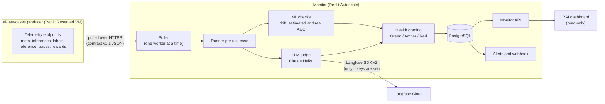
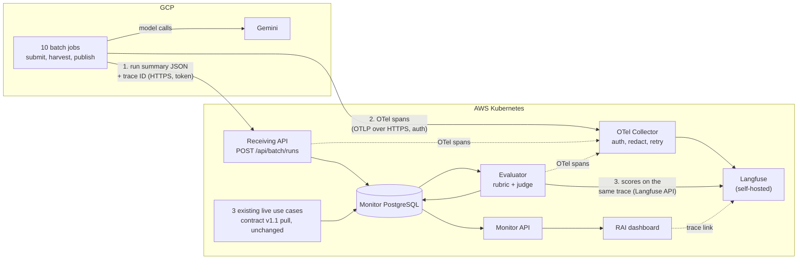

# October Batch Monitoring MVP — One-Page Summary

| | |
|---|---|
| **Date** | 2026-10-03 |
| **Period** | Mon 2026-10-05 to Fri 2026-10-30 |
| **Detail** | [Plan](plan.md) · [Issue drafts](issues.md) · [Older flow diagram](flow.html) |

## What we are building

By Friday 2026-10-30, the RAI team can see every completed run of the **10 GCP batch use
cases** on one dashboard: status, freshness, quality score (or "Unknown" with a reason),
and a link to a full trace of that run in Langfuse. Everything runs on the target AWS
Kubernetes cluster.

Two changes from how the monitor works today:

1. **GCP jobs push their results** to the monitor after publishing. Today the monitor
   pulls everything itself.
2. **OpenTelemetry (OTel) becomes the tracing standard** for the whole stack. Today
   there is no OTel anywhere; "telemetry" means our own JSON contract (v1.1).

## Current flow (today)

What runs now, on Replit, for the three live use cases (churn `AICT-L01`, chatbot
`AICT-L02`, NBA `AICT-L03`):

| Part | How it works today |
|---|---|
| Getting data | The monitor pulls closed time windows of raw records from each producer over HTTPS. Custom JSON format, contract v1.1. |
| Safety of data | Each window has a checksum and is stored once and never edited. The read position (cursor) moves only after a safe write. |
| Quality checks | ML: drift (Evidently), estimated accuracy (NannyML), real accuracy once labels arrive. LLM: a Claude judge scores each chatbot answer. |
| Result | Green / Amber / Red per use case, alerts on changes, shown on a read-only dashboard. |
| Tracing | No OpenTelemetry. The judge sends traces and scores to Langfuse Cloud directly with the Langfuse SDK v2, best-effort. The monitor itself writes JSON logs only. |
| Batch jobs in GCP | Not monitored at all. |

## Target flow (end of October)

Each GCP job sends two things after it publishes:

| What | Goes to | Purpose | If it is lost |
|---|---|---|---|
| **Run summary** (small JSON: use case, run ID, status, counts, tokens, completion time, trace ID) | Monitor receiving API | The official record that a run finished. Drives the dashboard and grading. | Job retries; sending twice is safe; a missed run raises an alert |
| **OTel spans** (timing of each step and each Gemini call) | OTel Collector, then Langfuse | Lets engineers see where time and tokens went in a run | Run still counts; the trace is incomplete |

**One trace per batch run.** The job starts a trace and passes its ID in the run summary
(W3C `traceparent`). The monitor continues the same trace, so Langfuse shows the whole
story in one place:

| Span | Where | Records |
|---|---|---|
| `batch.run` (root) | GCP job | use case, run ID, status |
| `batch.submit`, `batch.harvest`, `batch.publish` | GCP job | duration, row counts |
| Gemini call spans | GCP job | model, input and output tokens, real call latency (OTel GenAI conventions); no prompt or customer text |
| `monitor.ingest` | AWS monitor | validation result, stored once or duplicate |
| `monitor.evaluate` | AWS monitor | rubric version, sample size, result or Unknown reason |
| Score | Langfuse | attached to the same trace by ID |

## What OTel replaces, and what it does not

| Area | Old way | New way |
|---|---|---|
| Monitor → Langfuse | Langfuse SDK v2 calls straight to Langfuse Cloud | OTel SDK spans → Collector → self-hosted Langfuse; scores written with the Langfuse score API on the same trace ID |
| Monitor's own visibility | JSON logs only | OTel spans for the API, outgoing HTTP and database calls; logs carry the trace ID |
| GCP batch jobs | Nothing | OTel SDK in each job: one trace per run |
| Dashboard data | Monitor database | **Unchanged.** The dashboard reads the monitor API, never Langfuse. |
| Run summary from GCP | — | **Stays a JSON push**, not OTel (see below) |
| Contract v1.1 data windows (features, labels, reference, chatbot traces) | Custom JSON pull | **Unchanged in October.** Moving chatbot traces to OTel is a later step. |

Why the run summary and ML data windows stay outside OTel:

- OTel delivery is best-effort. Spans can be sampled, batched or dropped under load.
  The monitor's grading needs every run exactly once, with a checksum.
- Labels arrive days later and must be matched to the original records. OTel has no
  idea of a closed window or of late data.
- ML drift needs complete feature datasets, which are not traces.
- Langfuse accepts OTel **traces** only, not metrics or logs, and OTel cannot write
  evaluation scores. Scores always need a separate Langfuse call.

## Month at a glance

| Sprint | Dates | Data | OpenTelemetry | Use cases | Demo on Friday |
|---|---|---|---|---|---|
| **1** | Oct 5–9 | Agree the run summary JSON with the GCP developer; build the receiving API | Add the OTel SDK to the monitor; the receiving API continues the job's trace | 1 | One real run arrives; its ingest span carries the job's trace ID |
| **2** | Oct 12–16 | Registry, evaluation with a reviewed rubric | Local Collector + Langfuse; move the monitor off Langfuse SDK v2; OTel in 4 GCP jobs | 4 | One run shows as a single trace in Langfuse, from GCP job to score |
| **3** | Oct 19–23 | Harder jobs, missed-run alerts | Collector auth, TLS, redaction and retry; outage drills; OTel in 8 jobs | 8 | Collector outage drill loses no run records |
| **4** | Oct 26–30 | All 10 runs on AWS | Collector and Langfuse on the AWS cluster; jobs point at AWS | 10 | 10-row evidence checklist with trace IDs, signed off |

## Decisions still needed

| Decision | Owner | Needed by |
|---|---|---|
| Is GCP → AWS OTel traffic (OTLP) allowed, and how is it authenticated? | Security + platform | Fri Oct 16 |
| Langfuse Python SDK: stay on v2 or move to v3 (which is built on OTel)? | Backend | Mon Oct 12 |
| Which span attributes may leave GCP (no prompts, no customer text) | Security + RAI | Fri Oct 16 |
| New pip packages (`opentelemetry-*`, possibly `langfuse` v3) approved in the Sprint 2 spec | Project owner | Mon Oct 12 |
| When to move the chatbot's v1.1 trace window to OTel (after October) | Project owner + producer owner | November |
