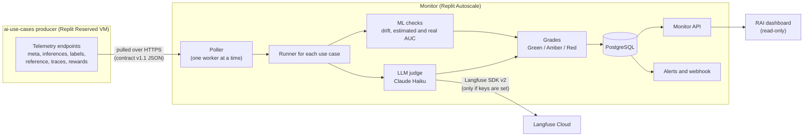
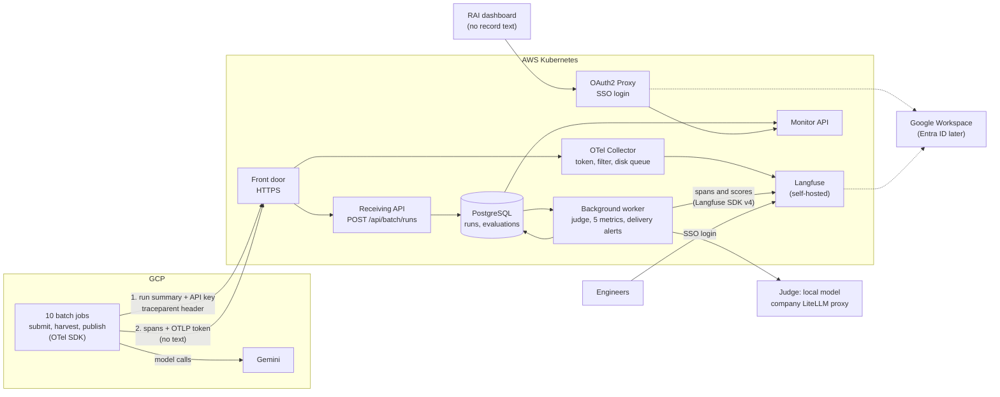

# October Batch Monitoring MVP — Summary

| | |
|---|---|
| **Date** | 2026-10-05 (SSO login and the LiteLLM judge added) |
| **Period** | Monday 2026-10-05 to Friday 2026-10-30 |
| **Language** | ASD-STE100 (Simplified Technical English), about 80% strict |
| **Details** | [Plan](plan.md) · [LLM metrics and data standard](llm-metrics-standard.md) · [Issues](issues.md) |

## What we build

By Friday 30 October, the RAI team sees each completed run of the **10 GCP batch use
cases** on one dashboard: the status, the freshness and the grade of the five LLM metrics,
or "Unknown" with a reason. Engineers see one trace for each run in Langfuse. The stack runs
on the production AWS Kubernetes cluster.

Five changes from the monitor today:
1. **The GCP jobs send their results** to the backend after they publish. Today, the monitor pulls the data itself.
2. **OpenTelemetry (OTel) is the tracing standard.** Today, the stack has no OTel. "Telemetry" means our own JSON contract (v1.1).
3. **The GCP use cases replace the prototype use cases** on the dashboard. The prototype is a scaffold. The shared code stays. The prototype-only code is removed after the release.
4. **The judge is a local model through the company LiteLLM proxy.** Today, it is Claude Haiku through the Anthropic API. RAI accepts the new judge before release (S2-10).
5. **The staff log in with SSO** (Google now, Entra ID later). Today, the dashboard has no login (S3-07).

## What we measure

All 10 use cases use the **same five LLM metrics as the prototype**, with the same bands and
the same judge definitions. The judge model is a local model through the company LiteLLM proxy. The GCP job sends only the data that these metrics need. The backend
calculates all the metrics.

| Metric | Green | Red | Data from GCP |
|---|---|---|---|
| `hallucination_rate` | < 0.02 | ≥ 0.02 | answer, source material, refused flag |
| `groundedness` | ≥ 0.85 | < 0.70 | answer, source material, refused flag |
| `relevance` | ≥ 0.85 | < 0.70 | instruction, answer |
| `pii_exposure_rate` | 0.0 | ≥ 0.01 | answer, with PII replaced by placeholders |
| `p95_latency_s` | ≤ 4.0 s | ≥ 8.0 s | the time of each request ("Unknown" for the Gemini Batch API) |

Until security approves the records, the jobs work in **identity-only mode**: they send the
run without records, and all five metrics are "Unknown". Such a use case does not pass the
release.

## The monitor today

The three prototype use cases (churn `AICT-L01`, chatbot `AICT-L02`, NBA `AICT-L03`) on Replit:



| Part | How it works today |
|---|---|
| Data | The monitor pulls closed time windows of raw records from the producer, in our own JSON format (contract v1.1) |
| Safety of the data | Each window has a checksum. It is stored one time and never changes. |
| Quality | ML: drift (Evidently), estimated accuracy (NannyML), real accuracy when labels arrive. LLM: a Claude judge scores each chatbot answer. |
| Result | Green, Amber or Red for each use case, alerts, and a read-only dashboard |
| Traces | No OpenTelemetry. The judge sends to Langfuse Cloud with the Langfuse SDK v2, which is deprecated. |
| GCP batch jobs | Not monitored |

## The monitor at the end of October



After it publishes, each GCP job sends two things:

| What | To | Purpose | If it is lost |
|---|---|---|---|
| **Run summary**: run identity and about 50 redacted records | Backend API | The official record of the run. The backend calculates the metrics from it. | The job tries again. A send again is safe. A missing run opens a delivery alert. |
| **OTel spans**: the steps, the times and the token totals, with no text | Collector, then Langfuse | Engineers see where the time and the tokens went | The run still counts. The trace has a gap. |

**One trace for each run.** The OTel SDK puts the trace ID in the `traceparent` header of
the API call. The backend continues the same trace. Thus Langfuse shows the full run in one
place:

```
Trace of the run          Scores: the five run metrics
  ├─ batch.run (GCP)
  │   ├─ batch.submit
  │   ├─ batch.harvest     token totals
  │   ├─ batch.publish
  │   └─ batch.send
  ├─ monitor.ingest
  └─ monitor.evaluate
      ├─ record 1          Scores: groundedness, relevance, hallucination, pii
      └─ … one observation for each judged record
```

## What OTel replaces, and what it does not replace

| Area | Old method | New method |
|---|---|---|
| Backend to Langfuse | Langfuse SDK v2 to Langfuse Cloud | Langfuse SDK v4 (built on OTel) to self-hosted Langfuse |
| Chatbot store (prototype only) | Langfuse SDK v2 | Its Langfuse part is removed (S2-02). It is not changed to v4. |
| GCP batch jobs | Nothing | OTel SDK in each job. Spans go to the Collector. |
| Dashboard data | Monitor database | **No change.** The dashboard reads the monitor API, never Langfuse. |
| Run summary from GCP | — | **A JSON send to the API**, not OTel |

Why the run summary is not sent with OTel:
- OTel delivery is "best effort". Spans can be dropped under load. The grades need each run one time, with all its records.
- The API tells the job "stored", "duplicate" or "wrong". OTel tells the job nothing.
- The API examines each body with the schema. The Collector does not know our schema.
- The Collector sends to Langfuse. It does not write to our monitor tables.

## The month

| Sprint | Dates | Data | OpenTelemetry and Langfuse | Use cases | Demo on Friday |
|---|---|---|---|---|---|
| **1** | 5 to 9 October | Test host VM in GCP on a private VPC path, JSON body v1, receiving API, GCP send step, identity-only mode | OTel in the first job and in the backend. Collector with file output. | 1 | One real run arrives, with one trace |
| **2** | 12 to 16 October | YAML registry, five-metric evaluator, LiteLLM judge and its acceptance by RAI, dashboard with the GCP use cases | Self-hosted Langfuse, SDK v4 in the backend, OTel helper file | 4 | One trace from the GCP job to the scores. The grade is on the dashboard. |
| **3** | 19 to 23 October | 8 use cases, delivery alerts, SSO login, security review | Collector hardening, drills, Kubernetes files on the test AWS cluster | 8 | The drills pass. The stack runs on the test AWS cluster. |
| **4** | 26 to 30 October | All 10 use cases send to AWS | Production cluster | 10 | The 10-row evidence checklist is signed |

## Open items

| Item | Owner | Needed by |
|---|---|---|
| Security approval of the records, the PII list and the data flow | Security | 8 October |
| Inventory of the 10 use cases and their run dates | PM + owners | 9 October |
| LiteLLM proxy access: URL, virtual keys, model alias, log policy (S1-12) | LiteLLM proxy owner | 9 October |
| RAI accepts the local judge (S2-10) | RAI | 16 October |
| Private DNS name for the test host (GCP) and two Google OAuth clients, for SSO (long-lead) | Your team, Google Workspace administrator | 19 October |
| Test AWS cluster, RDS and S3, DNS name, production cluster (long-lead requests) | Your team, platform | 19 to 26 October |
| On-call owner and alert owner | Project owner | Before the sign-off |

`flow.html` in this folder is the first version of the flow diagram. The diagrams above
replace it.
